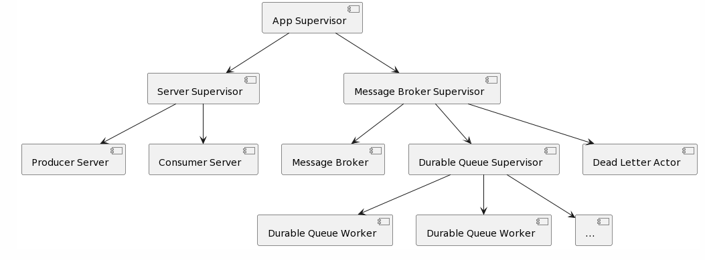
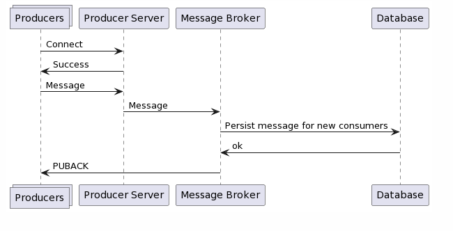
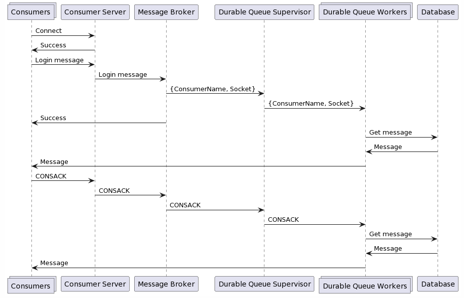
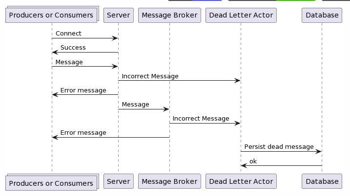
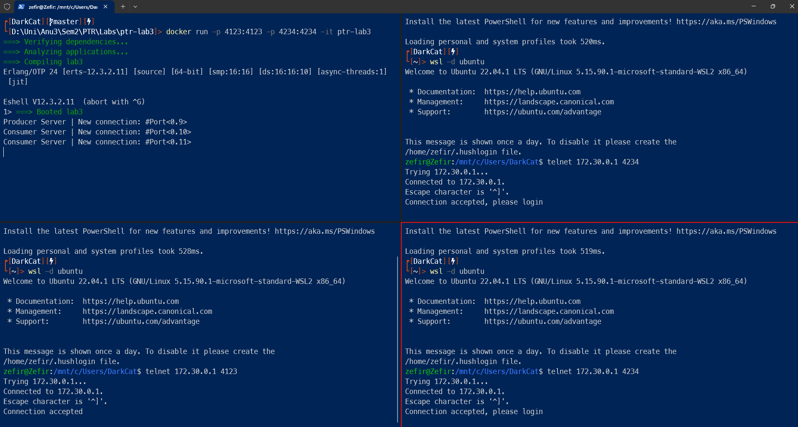
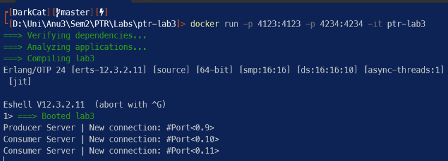

# FAF.PTR16.1 -- Project 2

> **Performed by:** Viorel Noroc, group FAF-203

> **Verified by:** asist. univ. Alexandru Osadcenco

## Diagrams
Supervision tree



Producer message


Consumer login message


Dead message

## Minimal Tasks

**Task 1** -- The message broker provides the ability to subscribe to multiple topics (if you are a consumer) and publish messages on different topics (if you are a publisher)

```erlang
handle_logged_consumer(Socket,
                       #{<<"subscribe">> := TopicName} = _JsonMap,
                       ConsumerName) ->
  case db:consumer_subscribe(ConsumerName, TopicName) of
    topic_not_found ->
      gen_tcp:send(Socket, "Topic not found\r\n");
    already_subscribed ->
      gen_tcp:send(Socket, "Already subscribed\r\n");
    _ ->
      ok
  end;
```

```erlang
handle_consumer(Socket, #{<<"login">> := ConsumerName} = _JsonMap, LoggedConsumers) ->
  case maps:is_key(Socket, LoggedConsumers) of
    true ->
      gen_tcp:send(Socket, "Already logged in\r\n"),
      LoggedConsumers;
    _ ->
      Users = maps:values(LoggedConsumers),
      case lists:member(ConsumerName, Users) of
        true ->
          gen_tcp:send(Socket, "User already logged in\r\n"),
          LoggedConsumers;
        _ ->
          dq_supervisor:start_queue(ConsumerName, Socket),
          gen_tcp:send(Socket, "Logged in\r\n"),
          maps:put(Socket, ConsumerName, LoggedConsumers)
      end
  end;
handle_consumer(Socket, JsonMap, LoggedConsumers) ->
  case maps:is_key(Socket, LoggedConsumers) of
    true ->
      spawn(fun() -> handle_logged_consumer(Socket, JsonMap, maps:get(Socket, LoggedConsumers))
            end);
    _ ->
      gen_tcp:send(Socket, "Please log in first\r\n")
  end,
  LoggedConsumers.
```

```erlang
handle_producer(Socket, #{<<"topic">> := Topic, <<"message">> := Message} = _JsonMap) ->
  ok = db:upsert_topic_message(Topic, Message),
  gen_tcp:send(Socket, "PUBACK\r\n");
```

```erlang
-module(mb).

-export([start/0]).

start() ->
  Pid = spawn_link(fun() -> loop(#{}) end),
  register(message_broker, Pid),
  {ok, Pid}.

loop(LoggedConsumers) ->
  receive
    {consumer, Socket, JsonMap} ->
      loop(handle_consumer(Socket, JsonMap, LoggedConsumers));
    {producer, Socket, JsonMap} ->
      handle_producer(Socket, JsonMap);
  end,
  loop(LoggedConsumers).
```

The `handle_logged_consumer/3` function handles requests from logged-in consumers. It checks if a topic exists in the database and sends appropriate responses based on the result.

The `handle_consumer/3` function handles requests from consumers who are logging in. It verifies if the consumer is already logged in or if the user is logged in with a different socket. If the conditions are met, it starts a queue for the consumer and adds them to the logged-in consumers list.

The `handle_producer/2` function handles requests from producers to publish messages to a specified topic. It updates or inserts the topic and its associated message in the database and sends a confirmation message back to the producer.

The `start/0` function in the `mb` module initializes the message broker by spawning a process and registering it with the name "message_broker". The process listens for messages from consumers and producers and handles them accordingly.

**Task 2** -- The message broker represents a dedicated TCP / UDP server

```erlang
-module(server_supervisor).

-behaviour(supervisor).

-export([start_link/0]).
-export([init/1]).

-define(SERVER, ?MODULE).

start_link() ->
  supervisor:start_link({local, ?SERVER}, ?MODULE, []).

init([]) ->
  MaxRestarts = 3,
  MaxTime = 1,
  SupFlags =
    #{strategy => one_for_one,
      intensity => MaxRestarts,
      period => MaxTime},

  ServerProducer =
    #{id => server_producer,
      start => {server_producer, start, [4123]},
      restart => permanent,
      modules => [server_producer]},
  ServerConsumer =
    #{id => server_consumer,
      start => {server_consumer, start, [4234]},
      restart => permanent,
      modules => [server_consumer]},
  ChildSpecs = [ServerProducer, ServerConsumer],
  {ok, {SupFlags, ChildSpecs}}.

```

```erlang
-module(server_producer).

-export([start/1]).

start(Port) ->
  {ok, Socket} = gen_tcp:listen(Port, [binary, {active, false}]),
  Pid = spawn_link(fun() -> accept(Socket) end),
  {ok, Pid}.

accept(ListenSocket) ->
  case gen_tcp:accept(ListenSocket) of
    {ok, Socket} ->
      io:format("Producer Server | New connection: ~p~n", [Socket]),
      Pid =
        spawn(fun() ->
                 gen_tcp:send(Socket, "Connection accepted\r\n"),
                 loop(Socket)
              end),
      gen_tcp:controlling_process(Socket, Pid),
      accept(ListenSocket);
    Error ->
      exit(Error)
  end.

loop(Sock) ->
  inet:setopts(Sock, [{active, once}]),
  receive
    {tcp, Socket, Data} ->
      io:format("Producer Server | Got packet from ~p: ~p~n", [Socket, Data]),
      case json_helper:try_decode(Data) of
        {true, JsonMap} ->
          message_broker ! {producer, Socket, JsonMap};
        _ ->
          dead_letter ! {producer, Data},
          gen_tcp:send(Socket, "Invalid json, try again\r\n")
      end,
      loop(Socket);
    {tcp_closed, Socket} ->
      io:format("Producer Server | Connection ~p closed~n", [Socket]);
    {tcp_error, Socket, Reason} ->
      io:format("Producer Server | Error on connection ~p reason: ~p~n", [Socket, Reason])
  end.
```

```erlang
-module(server_consumer).

-export([start/1]).

start(Port) ->
  {ok, Socket} = gen_tcp:listen(Port, [binary, {active, false}]),
  Pid = spawn_link(fun() -> accept(Socket) end),
  {ok, Pid}.

accept(ListenSocket) ->
  case gen_tcp:accept(ListenSocket) of
    {ok, Socket} ->
      io:format("Consumer Server | New connection: ~p~n", [Socket]),
      Pid =
        spawn(fun() ->
                 gen_tcp:send(Socket, "Connection accepted, please login\r\n"),
                 loop(Socket)
              end),
      gen_tcp:controlling_process(Socket, Pid),
      accept(ListenSocket);
    Error ->
      exit(Error)
  end.

loop(Sock) ->
  inet:setopts(Sock, [{active, once}]),
  receive
    {tcp, Socket, Data = <<"CONSACK\r\n">>} ->
      io:format("Consumer Server | Got packet from ~p: ~p~n", [Socket, Data]),
      message_broker ! {consack, Socket},
      loop(Socket);
    {tcp, Socket, Data} ->
      io:format("Consumer Server | Got packet from ~p: ~p~n", [Socket, Data]),
      case json_helper:try_decode(Data) of
        {true, JsonMap} ->
          message_broker ! {consumer, Socket, JsonMap};
        _ ->
          dead_letter ! {consumer, Data},
          gen_tcp:send(Socket, "Invalid json, try again\r\n")
      end,
      loop(Socket);
    {tcp_closed, Socket} ->
      message_broker ! {logoff, Socket},
      io:format("Consumer Server | Connection ~p closed~n", [Socket]);
    {tcp_error, Socket, Reason} ->
      io:format("Consumer Server | Error on connection ~p reason: ~p~n", [Socket, Reason])
  end.

```

`server_supervisor` manages two child processes: `server_producer` and `server_consumer`. The `server_producer` module handles connections from producer clients, while the `server_consumer` module handles connections from consumer clients. Both modules initialize TCP sockets for each connection adn forward the received data from the connections to the `message_broker` process for further processing and message distribution.

**Task 3** -- The message broker allows for clients to connect via telnet / netcat



In the screenshot above shows 1 producer and 2 clients connecting to the message broker via `telnet 172.30.0.1 4123` or `4234`. The ip differs from localhost because it is called from an ubuntu distribution on WSL.

**Task 4** -- The project has an executable that can run the message broker with a single click / command

The message broker can be run by running either the rebar3 command or via docker.

```shell
rebar3 shell
```

or

```shell
docker build -t ptr-lab3 .

docker run -p 4123:4123 -p 4234:4234 -it ptr-lab3 
```

## Main Tasks

**Task 1** -- The message broker provides the ability to unsubscribe to consumers

```erlang
handle_logged_consumer(Socket,
                       #{<<"unsubscribe">> := TopicName} = _JsonMap,
                       ConsumerName) ->
  case db:consumer_unsubscribe(ConsumerName, TopicName) of
    not_found ->
      gen_tcp:send(Socket, "Topic not found\r\n");
    _ ->
      ok
  end;
```

The code above works just like the subscribe functionality but instead of adding to the subscribed list, it removes the given name from it.

**Task 2** -- The message broker has a dead letter channel for messages deemed “unsendable”

```erlang
-module(dead_letter).

-export([start/0]).

start() ->
  Pid = spawn_link(fun() -> loop() end),
  register(dead_letter, Pid),
  {ok, Pid}.

loop() ->
  receive
    {From, Msg} ->
      db:insert_dead_letter(From, Msg)
  end,
  loop().
```

```erlang
insert_dead_letter(From, Msg) ->
  true = dets:insert_new(dead_letter_table, auditable(From, Msg)).

auditable(From, Msg) ->
  {{id, uuid()}, {from, From}, {time, calendar:universal_time()}, {message, {Msg}}}.
```

Any messages that are considered as errors or have incorrect format are sent to the `dead_letter` process which adds an auditable row in the dets table.

**Task 3** -- The message broker allows for communication via structures / classes, serialized to be sent via network

```erlang
{tcp, Socket, Data} ->
      io:format("Consumer Server | Got packet from ~p: ~p~n", [Socket, Data]),
      case json_helper:try_decode(Data) of
        {true, JsonMap} ->
          message_broker ! {consumer, Socket, JsonMap};
        _ ->
          dead_letter ! {consumer, Data},
          gen_tcp:send(Socket, "Invalid json, try again\r\n")
      end,
```

```erlang
-module(json_helper).

-export([try_decode/1]).

try_decode(BinaryString) ->
  try
    {true, jsx:decode(BinaryString)}
  catch
    _:_ ->
      {false}
  end.
```

The `jsx` library was used to decode json messages incoming from telnet conenctions.

**Task 4** -- The message broker provides MQTT-style assured delivery

```erlang
handle_producer(Socket, #{<<"topic">> := Topic, <<"message">> := Message} = _JsonMap) ->
  ok = db:upsert_topic_message(Topic, Message),
  gen_tcp:send(Socket, "PUBACK\r\n");
```

This message broker implements qos1 MQTT assured delivery. It sends back to the producer the message `PUBACK` after the message was inserted in the dets table.

**Task 5** -- The message broker ensures reliable message delivery using Persistent Messages with subscriber acknowledgments and Durable Queues

```erlang
-module(dq_worker).

-export([start/2]).

start(ConsumerName, Socket) ->
  db:create_consumer_topics(ConsumerName),
  Pid = spawn_link(fun() -> loop(ConsumerName, Socket) end),
  {ok, Pid}.

loop(ConsumerName, Socket) ->
  TopicsMap = db:get_consumer_topics_map(ConsumerName),
  maps:foreach(fun(K, V) -> for_each(ConsumerName, Socket, K, V) end, TopicsMap),
  loop(ConsumerName, Socket).

for_each(ConsumerName, Socket, Key, Value) ->
  case db:get_topic_message_by_index(Key, Value) of
    no_new_messages ->
      ok;
    Message ->
      gen_tcp:send(Socket,
                   iolist_to_binary(["Topic: ", Key, "\r\nMessage: ", Message, "\r\n"])),
      receive
        ack ->
          ok
      end,
      db:consumer_increment_topic_index(ConsumerName, Key);
    _ ->
      io:format("error")
  end.

```

```erlang
-module(dq_supervisor).

-behaviour(supervisor).

-export([start_link/0]).
-export([init/1]).
-export([start_queue/2, stop_queue/1, send_ack/1, get_children/0]).

-define(SERVER, ?MODULE).

start_link() ->
  supervisor:start_link({local, ?SERVER}, ?MODULE, []).

init([]) ->
  MaxRestarts = 3,
  MaxTime = 1,
  SupFlags =
    #{strategy => one_for_one,
      intensity => MaxRestarts,
      period => MaxTime},
  {ok, {SupFlags, []}}.

start_queue(ConsumerName, Socket) ->
  supervisor:start_child(?MODULE,
                         #{id => ConsumerName,
                           start => {dq_worker, start, [ConsumerName, Socket]},
                           restart => permanent,
                           shutdown => 2000,
                           type => worker,
                           modules => [dq_worker]}).

stop_queue(ConsumerName) ->
  supervisor:terminate_child(?MODULE, ConsumerName).

send_ack(ConsumerName) ->
  [{_Id, ChildPid, _, _}] =
    lists:filter(fun(Elem) ->
                    case Elem of
                      {ConsumerName, _Pid, _, _} -> true;
                      _ -> false
                    end
                 end,
                 get_children()),
  ChildPid ! ack,
  ok.

get_children() ->
  supervisor:which_children(?MODULE).

```

The `dq_supervisor` process is a supervisor for the durable queues. `dq_supervisor` creates a `dq_worker` each time a consumer has logged in and the `dq_worker` queries the dets table for new messages and awaits acknowledgement from the consuemr for each message sent.

**Task 6** -- The project provides a Docker container to run the message broker

```dockerfile
# Use a base Erlang/OTP image
FROM erlang:24

# Set the working directory inside the container
WORKDIR /app

# Copy the rebar3 files into the container
COPY rebar.config rebar.lock ./

# Copy the application source code into the container
COPY src/ ./src

# Compile the Erlang application using Rebar3
RUN rebar3 compile

# Expose the desired ports
EXPOSE 4123 4234

# Start the Erlang application
CMD ["rebar3", "shell"]
```



A basic dockerfile was created for creating a docker image.

The commands for building and running the Docker container are as follows:

```
docker build -t ptr-lab3 .
```

```
docker run -p 4123:4123 -p 4234:4234 -it ptr-lab3 
```

## Conclusion

In conclusion, the project successfully implements an actor-based message broker application that manages communication between producers and consumers. The implemented message broker fulfills both the minimal and main features specified in the requirements.

The message broker provides the core functionality of allowing consumers to subscribe to publishers and receive messages, while also allowing publishers to publish messages for subscribed consumers. It operates as a dedicated TCP/UDP server, enabling clients to connect via telnet/netcat.

Consumers have the ability to subscribe to multiple topics, and publishers can publish messages on different topics. The message broker ensures reliable message delivery through features such as persistent messages, subscriber acknowledgments, and durable queues. It implements an MQTT-style assured delivery mechanism to guarantee message reliability.

Additionally, the message broker incorporates important features such as the ability to unsubscribe consumers, a dead letter channel for unsendable messages, and support for communication via serialized structures/classes sent over the network. The system provides detailed logging of events, including the starting/stopping of actors and connection/subscription events.

Completing the laboratory project has been a valuable learning experience. I have gained practical knowledge of message brokering concepts and actor-based programming. The project allowed me to understand the importance of logging and event tracking, as well as implementing features such as assured delivery and reliable messaging. Overall, this project has equipped me with essential skills for developing distributed systems and has provided a solid foundation for my future work in software development.

## Bibliography

[https://learnyousomeerlang.com/ets](https://learnyousomeerlang.com/ets)

[https://www.erlang.org/doc/man/dets.html](https://www.erlang.org/doc/man/dets.html)

[https://hex.pm/packages/uuid](https://hex.pm/packages/uuid)

[https://www.erlang.org/doc/man/supervisor.html](https://www.erlang.org/doc/man/supervisor.html)

[https://www.erlang.org/doc/man/maps.html](https://www.erlang.org/doc/man/maps.html)

[https://www.erlang.org/doc/man/lists.html](https://www.erlang.org/doc/man/lists.html)

[https://stackoverflow.com/questions/51364148/what-is-difference-between-active-false-active-true-and-active-once](https://stackoverflow.com/questions/51364148/what-is-difference-between-active-false-active-true-and-active-once)


### Project repository
[https://github.com/darkcat013/ptr-lab3](https://github.com/darkcat013/ptr-lab3)
